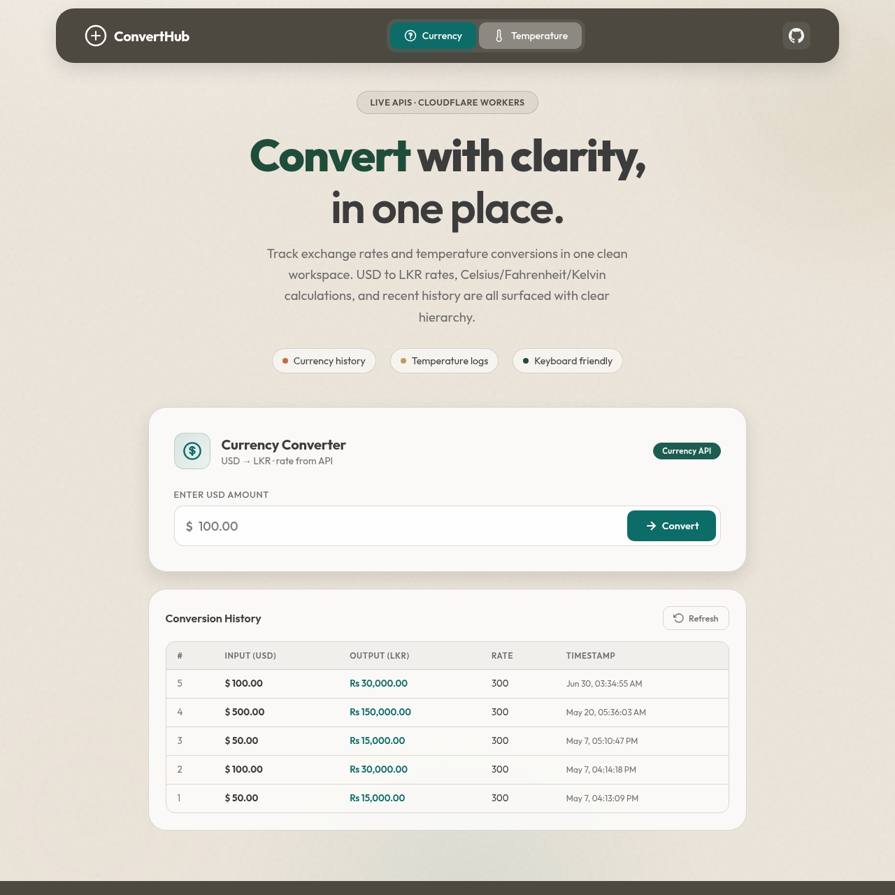

# ConvertHub — Temperature & Currency Converter

Spring Boot microservices + MongoDB for USD/LKR currency and temperature conversion, with a clean organic web UI.

**Live demo:** [https://api.adheesha.dev](https://api.adheesha.dev)

**Full usage guide:** [docs/USAGE-GUIDE.md](docs/USAGE-GUIDE.md)



## Features

- Currency conversion (USD → LKR) with MongoDB history
- Temperature conversion (Celsius, Fahrenheit, Kelvin) with history
- Safety check endpoint for heat warnings (Lab 04)
- Filtered temperature history by input unit (Lab 04)
- MongoDB-backed API key auth on temperature convert (Lab 05)
- Dockerized full stack (frontend + 2 APIs + 2 MongoDB instances)

## Architecture

```
Frontend (3000) ──┬── Temperature API (8081) ── MongoDB temp_db (27017)
                  └── Currency API (8082)   ── MongoDB currency_db (27018)
```

| Service | Port | Notes |
|---------|------|-------|
| Frontend UI | 3000 | Open this in the browser |
| Temperature API | 8081 | REST only — not the UI |
| Currency API | 8082 | REST only — not the UI |
| MongoDB (temp) | 27017 | `temp_db` + `api_keys` |
| MongoDB (currency) | 27018 | `currency_db` |

## Quick start (Docker)

```bash
docker compose up --build
```

Open **http://localhost:3000** for the UI.

Stop:

```bash
docker compose down
```

API keys are seeded automatically on startup via `mongo-seed`. To re-seed manually:

```bash
mongosh mongodb://localhost:27017/temp_db docs/mongo-seed-api-keys.js
```

## Project layout

```
Mongodb-with-API-testX/
├── tempconv/           # Temperature microservice (8081)
├── currencyconvertor/  # Currency microservice (8082)
├── frontend/           # Web UI
├── docs/               # Lab PDFs, demo screenshot, Mongo seed script
└── docker-compose.yml
```

## API reference

### Temperature (`8081`)

| Method | Endpoint | Auth |
|--------|----------|------|
| GET | `/api/temperatures/safety-check?value=&unit=` | None |
| GET | `/api/temperatures/history` | None |
| GET | `/api/temperatures/history/filter?unit=` | None |
| POST | `/api/temperatures/convert?value=&unit=` | `X-API-KEY` header |

### Currency (`8082`)

| Method | Endpoint | Auth |
|--------|----------|------|
| POST | `/api/currency/convert?usdAmount=` | None |
| GET | `/api/currency/history` | None |

### Lab 04 — Safety check & filtered history

```bash
curl "http://localhost:8081/api/temperatures/safety-check?value=102&unit=F"
# → Warning: 102.0°F is dangerously HOT! Stay hydrated.

curl "http://localhost:8081/api/temperatures/safety-check?value=21&unit=C"
# → The temperature is comfortable and safe.

curl "http://localhost:8081/api/temperatures/history/filter?unit=celsius"
# → JSON array of Celsius logs only
```

### Lab 05 — API key on convert

```bash
# Missing key → 401
curl -X POST "http://localhost:8081/api/temperatures/convert?value=25&unit=celsius"

# Invalid/inactive key → 401
curl -X POST "http://localhost:8081/api/temperatures/convert?value=25&unit=celsius" \
  -H "X-API-KEY: EXPIRED-HACKER-KEY-999"

# Valid key → 200
curl -X POST "http://localhost:8081/api/temperatures/convert?value=25&unit=celsius" \
  -H "X-API-KEY: SUPER-SECRET-DEV-KEY-123"
```

Seeded keys in the `api_keys` collection:

| Key | Active |
|-----|--------|
| `SUPER-SECRET-DEV-KEY-123` | yes |
| `EXPIRED-HACKER-KEY-999` | no |

## Local run (without Docker)

**Prerequisites:** Java 21, Maven, MongoDB 6+

1. Start MongoDB on ports `27017` and `27018`
2. Seed API keys: `mongosh mongodb://localhost:27017/temp_db docs/mongo-seed-api-keys.js`
3. Run temperature service:
   ```bash
   cd tempconv && ./mvnw spring-boot:run
   ```
4. Run currency service:
   ```bash
   cd currencyconvertor && ./mvnw spring-boot:run
   ```
5. Open `frontend/index.html` or serve the `frontend/` folder

## Tech stack

Spring Boot 4 · Java 21 · MongoDB · HTML/CSS/JS · Docker · Cloudflare Pages
